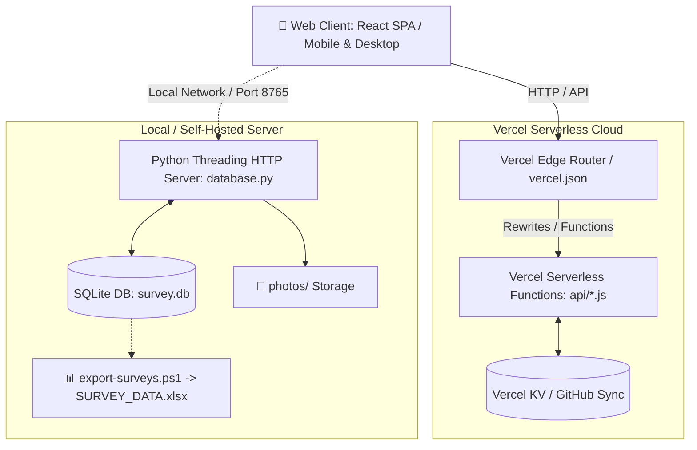

# NBTC Microwave — Pre-PM (Pre-Preventive Maintenance) Survey Control Room


ระบบศูนย์ควบคุมและบันทึกข้อมูลการเข้าตรวจเยี่ยมเจ้าของพื้นที่สำหรับงานบำรุงรักษาเชิงป้องกันล่วงหน้า (Pre-Preventive Maintenance) สถานีวิทยุคมนาคม NBTC Microwave

---

## 📋 ภาพรวมโครงการ (Project Overview)

**Pre-PM Survey Control Room** ได้รับการออกแบบขึ้นมาเพื่ออำนวยความสะดวกให้แก่วิศวกรและช่างเทคนิคภาคสนามในการลงพื้นที่สำรวจสถานีวิทยุคมนาคม (NBTC Microwave) โดยครอบคลุมตั้งแต่การตรวจสอบสิทธิ์การเข้าพื้นที่ บันทึกสภาพอุปกรณ์ ตรวจสอบระบบสื่อสาร ระบบไฟฟ้า เสาอากาศ ตลอดจนการถ่ายภาพและสรุปผล เพื่อส่งข้อมูลเข้าสู่ส่วนกลางแบบเรียลไทม์

ระบบรองรับทั้งการรันแบบ **Standalone / On-Premises (Python + SQLite)** และแบบ **Cloud Serverless (Vercel Functions + Vercel KV / GitHub Sync)** พร้อมหน้าต่างควบคุม (Control Room Dashboard) สไตล์ Glassmorphism ที่ทันสมัยและตอบสนองได้ทุกอุปกรณ์ (Desktop, Tablet, Mobile)

---

## ✨ ฟีเจอร์หลัก (Key Features)

### 1. 📊 Survey Control Room Dashboard (ศูนย์ควบคุมงานสำรวจ)
- **Live Statistics**: สรุปตัวเลขผลสำรวจรวม, จำนวนสถานีทั้งหมดในฐานข้อมูล, สถิติการได้รับอนุญาต / ไม่อนุญาตเข้าพื้นที่
- **Provincial Heatmap / Bar Chart**: กราฟแสดงสถิติการสำรวจแยกตามจังหวัดแบบเรียลไทม์
- **Recent Survey Activity Table**: ตารางแสดงรายการสำรวจล่าสุด พร้อมผลการอนุญาตและเวลาที่บันทึก
- **Auto-polling**: อัปเดตข้อมูลอัตโนมัติทุก 30 วินาที

### 2. 📝 Field Visit / Site Record (แบบบันทึกการเข้าตรวจเยี่ยม)
- **01 ข้อมูลสถานี (Station Info)**: ดึงรายชื่อสถานีและสถานที่ติดตั้งจากฐานข้อมูล (`DATABASE.xlsx`) แบบ Datalist Auto-complete
- **02 ผู้ให้ข้อมูลในพื้นที่ (Local Informant)**: บันทึกชื่อ, ตำแหน่ง, หน่วยงาน/หมู่บ้าน และเบอร์โทรศัพท์ติดต่อ
- **03 การขออนุญาตเข้าพื้นที่ (Site Access Permit)**: ระบุผลการขออนุญาต (อนุญาต/ไม่อนุญาต) และข้อจำกัดในการเข้าพื้นที่
- **04 สอบถามการใช้งาน (Radio & Power Status)**: ประเมินการใช้งานเครื่องวิทยุ, ปัญหาการรับ/ส่งสัญญาณ, ปัญหาระบบไฟฟ้า และระบบแบตเตอรี่สำรอง
- **05 สภาพแวดล้อมหน้างาน (Site Environment)**: บันทึกสภาพตู้ติดตั้งอุปกรณ์, สภาพเสาและสายอากาศที่มองเห็นได้จากพื้นดิน, อุปสรรคในการปฏิบัติงาน
- **06 ภาพถ่ายก่อนดำเนินงาน (Photo Documentation)**: อัปโหลดและบันทึกภาพถ่ายหน้างานหลายไฟล์พร้อมกัน
- **07 ยืนยันข้อมูล (Sign-off & Confirmation)**: สรุปสิ่งที่ได้รับแจ้ง พร้อมบันทึกชื่อผู้ให้ข้อมูลและช่างผู้ปฏิบัติงาน

### 3. 🔐 ความปลอดภัยและการเข้าถึง (Security & Access Control)
- ระบบล็อกอินด้วยรหัสผ่านผ่าน Token-based Authentication (HMAC SHA-256)
- ป้องกันการเข้าถึงไฟล์ข้อมูลสำคัญทาง URL โดยตรง (ตั้งค่า 404 Rewrite สำหรับ `access-password.txt`, `DATABASE.xlsx`, `survey.db`, `SURVEY_DATA.xlsx`)
- รองรับการตั้งรหัสผ่านผ่านไฟล์ `access-password.txt` หรือ Environment Variable `FORM_PASSWORD`

---

## 🏗️ โครงสร้างสถาปัตยกรรม (Architecture)



---

## 📁 โครงสร้างโปรเจกต์ (Project Structure)

```text
Pre-PM/
├── src/
│   ├── components/
│   │   ├── auth/              # ระบบยืนยันตัวตน (LoginView)
│   │   ├── dashboard/         # ศูนย์ควบคุม (DashboardView, KpiCards, ProvinceChart, SurveyDonut, RecentSurveys)
│   │   ├── field/             # แบบบันทึกตรวจเยี่ยมภาคสนาม (FieldVisitView)
│   │   ├── ui/                # Accessible Primitives (Radix UI) & Kinetic Effects (React Bits UI)
│   │   ├── Navbar.jsx         # แถบหัวระบบแบบสด พร้อมนาฬิกาและสถานะการเชื่อมต่อ
│   │   └── Sidebar.jsx        # แถบเมนูนำทางด้านข้างแบบ Glassmorphic (Lucide Icons)
│   ├── lib/
│   │   ├── api.js             # Client API Service Layer
│   │   └── utils.js           # Class merging utilities (clsx + tailwind-merge)
│   ├── App.jsx                # Single Page Application Shell & Routing
│   ├── index.css              # Tailwind CSS 4.0 Theme & Tokens
│   ├── main.jsx               # Vite Entry Point
│   └── version.js             # Authoritative Single Source of Truth
├── api/                       # Vercel Serverless Functions (_core.js, _handler.js, routes)
├── .gitignore                 # ตั้งค่า Ignore ไฟล์ชั่วคราว, dist, DB, และ node_modules
├── access-password.txt        # รหัสผ่านเริ่มต้นสำหรับเข้าสู่ระบบ
├── DATABASE.xlsx              # ฐานข้อมูลสถานีหลัก (Master Station Records)
├── database.py                # เซิร์ฟเวอร์ Python รองรับ Local API และเสิร์ฟ Vite Production Build
├── index.html                 # Vite SPA Entry HTML
├── package.json               # Node.js dependencies & scripts (React 18.3, Vite 5.4, Tailwind 4, Radix, Lucide)
├── vercel.json                # การตั้งค่า Deploy สู่ Vercel
├── vite.config.mjs            # Vite 5.4 configuration พร้อม Tailwind 4 & API Proxies
└── README.md                  # เอกสารคู่มือโครงการ
```

---

## 🚀 การติดตั้งและใช้งาน (Getting Started)

### การพัฒนาและทดสอบระบบ Frontend (Vite Dev Server)

```bash
# 1. ติดตั้ง Dependencies
npm install

# 2. เริ่มต้น Vite Development Server (Hot Module Replacement)
npm run dev

# 3. สร้าง Production Bundle
npm run build

# 4. ทดสอบ Production Preview
npm run preview
```

### การรัน Backend + Frontend พร้อมกันบน Local

1. รันเซิร์ฟเวอร์ Python สำหรับบริการ API และเสิร์ฟหน้าเว็บ (`dist`):
   ```bash
   python database.py
   ```
2. เปิดเบราว์เซอร์ไปยัง `http://localhost:8765`
3. เข้าสู่ระบบด้วยรหัสผ่านใน `access-password.txt`

---

### วิธี Deploy สู่ Vercel (Cloud Serverless)

1. เชื่อมต่อ Git Repository เข้ากับบัญชี Vercel
2. ระบบจะสั่ง `npm run build` และเผยแพร่ไดเรกทอรี `dist` อัตโนมัติ:
   - **Framework Preset**: Vite
   - **Build command**: `npm run build`
   - **Output directory**: `dist`
3. ตั้งค่า Environment Variable:
   - `FORM_PASSWORD`: *(กำหนดรหัสผ่านสำหรับเข้าสู่ระบบ)*
   - `GITHUB_TOKEN`: *(Personal Access Token สำหรับซิงค์ข้อมูลลง Git อัตโนมัติ)*

## 📊 การส่งออกข้อมูลเป็น Excel (Export Data)

เมื่อมีการบันทึกผลสำรวจในระบบ Local สามารถรันสคริปต์ส่งออกข้อมูลเป็นไฟล์ Excel รายงานผล:

```powershell
.\export-surveys.ps1
```

ไฟล์รายงาน `SURVEY_DATA.xlsx` จะถูกสร้างขึ้นมาโดยอัตโนมัติ ประกอบด้วย:
1. **Sheet: SurveyData** — ข้อมูลรายการสำรวจพร้อมฟิลด์ครบถ้วนทุกข้อ
2. **Sheet: Dashboard** — สรุปภาพรวมยอดสำรวจ และจำนวนการลงพื้นที่แยกตามจังหวัด

---

## 🔒 ข้อควรระวังและสิทธิ์การใช้งาน (Security & Operational Notes)

- **รหัสผ่าน**: สำหรับ Production ขอแนะนำให้เปลี่ยนรหัสผ่านใน `access-password.txt` หรือกำหนดผ่านตัวแปรสภาพแวดล้อม `FORM_PASSWORD`
- **ไฟล์ข้อมูล**: ไฟล์ `.gitignore` ถูกกำหนดค่าไว้เพื่อป้องกันการ Commit ข้อมูลส่วนบุคคล (เช่น รูปถ่ายหน้างาน `photos/`, ฐานข้อมูล `survey.db`, และไฟล์สำรอง `backups/`) ขึ้น Git โดยไม่ตั้งใจ

---

## 👨‍💻 พัฒนาโดย (Maintained By)

- **Project**: NBTC Microwave Field Survey & Control Room System
- **Repository**: [https://github.com/Thaidimaru/Pre-PM](https://github.com/Thaidimaru/Pre-PM.git)